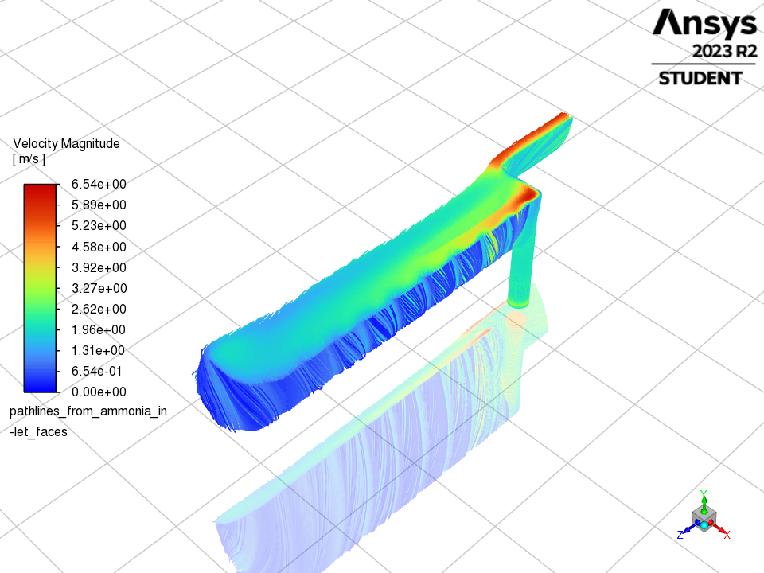
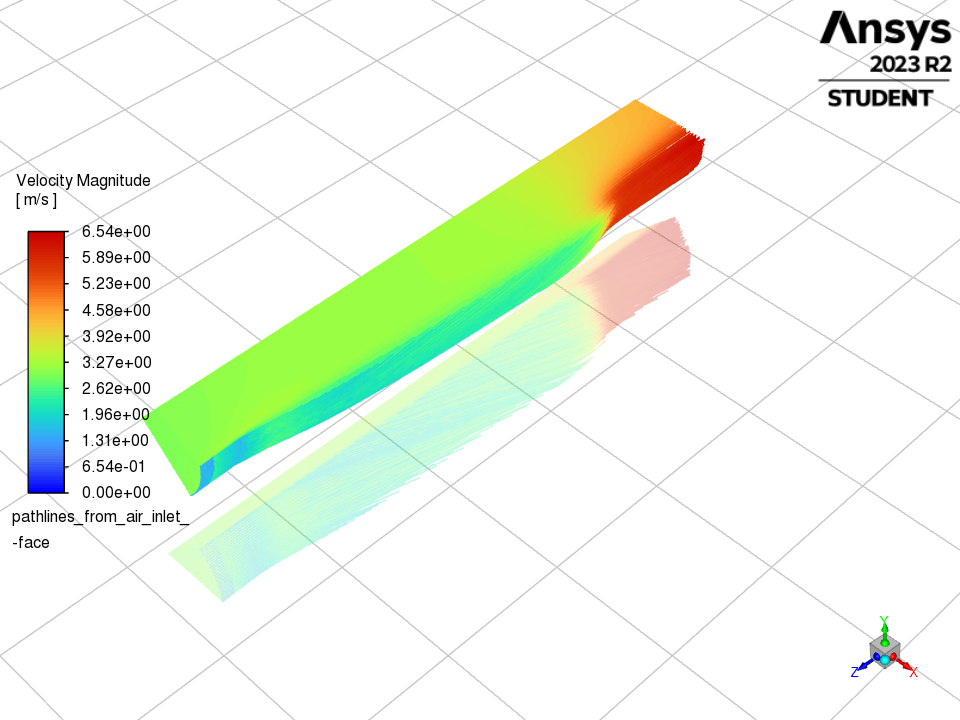
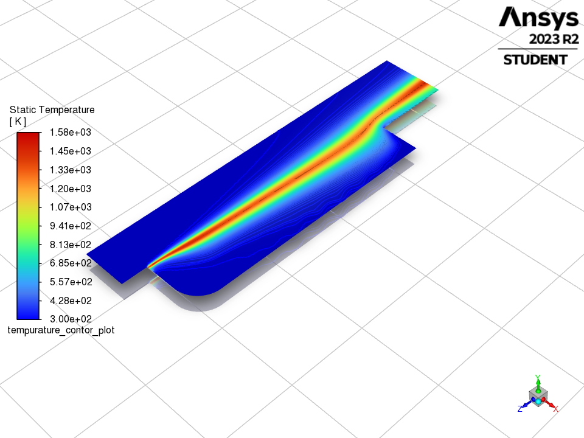
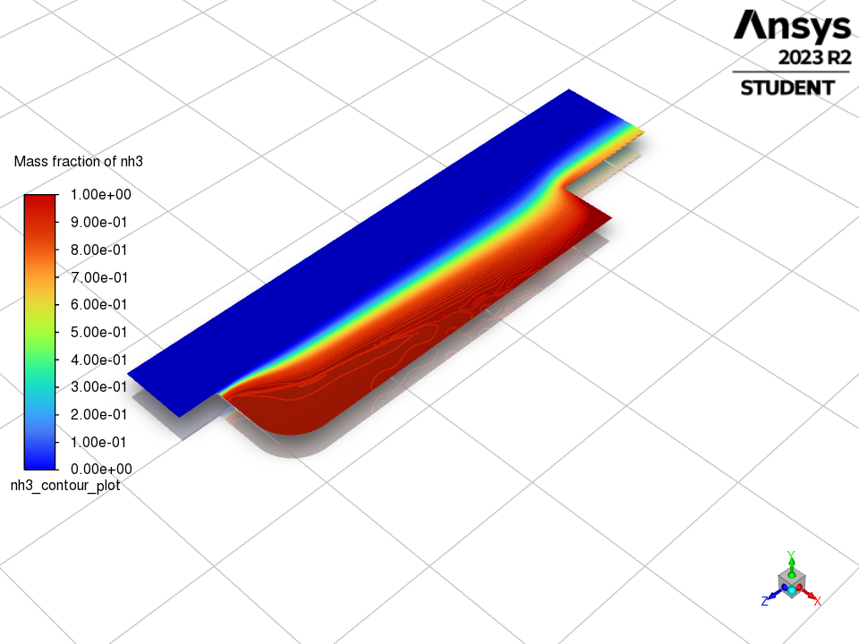
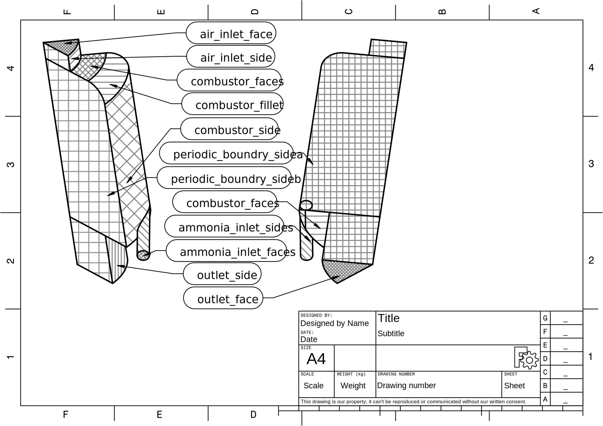

# Bidirectional_Vortex_Combustion_chamber_Automation
Automation scripts and information on how to simulate a variety of Bidirectional Combustion chambers using FreeCAD and Ansys Fluent platforms.

These automation scripts were used in my ammonia bidirectional vortex combustor project for my 3rd year of university disertation. The idea of this combustor is to reduce the NOx emissions when burning ammonia by forming an outer vortex of pure ammonia fuel with an inner vortex of the mixed air and ammonia burning. As the flame travels down, the upper flame was meant to be a lean flame while the later flame close to the exaust is meant to be richer as it allows ammonia to self clean the NOx emissions reforming it into N2.

Examples Included from my project:
- Ammonia Path Lines

- Air Path Lines

- Tempurature Contor plot

- Ammonia Contor plot

## Prerequisite
The following software must be preinstalled on a computer:
- [FreeCAD](https://www.freecad.org/) (Written for version 0.21.0 but later versions should work)
- [Ansys Fluent](https://www.ansys.com/products/fluids/ansys-fluent) (Written for 2023 but later versions should work)
- [Ansys Discovery](https://www.ansys.com/products/3d-design/ansys-discovery) (Used 2023 but later versions should work)
- [Python 3](https://www.python.org/)
- [Pyfluent](https://fluent.docs.pyansys.com/) (written for version 0.18.0 should work in later versions)

## How they work
The [flow charts](https://github.com/EthanTesting/Bidirectional_Vortex_Combustion_chamber_Automation/blob/main/Flow_Charts_of_Entire_Work_Process.pdf) in the repositry give a good overview of how the scripts should be used. It is best to view those charts to see how the entire script works. Take note of the specific names required for the faces of the geometry model.

Chemical kinetics files must be added for theses scripts to be used. Ansys fluent includes some on install but others can be included from external resources. The external chemical kinetics files used during my project are refereced bellow:
- Junichiro Otomo, M. K. b. T. M. c. H. I. c. K. Y. c. d., 2018. Chemical kinetic modeling ofammonia oxidation with improved reaction mechanism for ammonia/air andammonia/hydrogen/air combustion. International Journal of Hydrogen Energy, 43(5), pp. 3004- 3014.
- Konnov, A. A., 2023. An exploratory modelling study of chemiluminescence in ammonia-fuelled flames. Part 1. Combustion and Flame, Volume 253.

